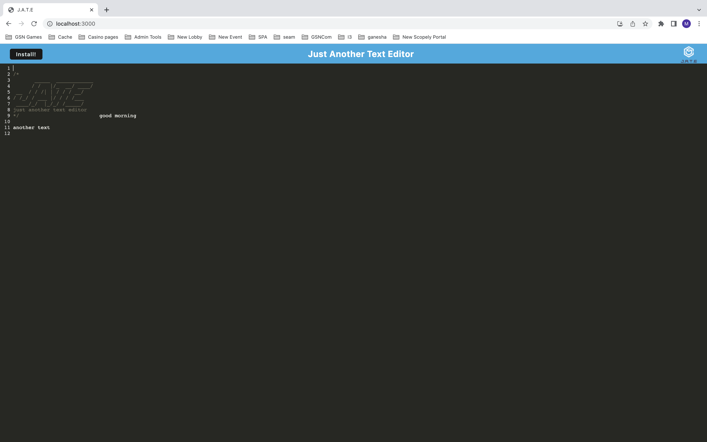
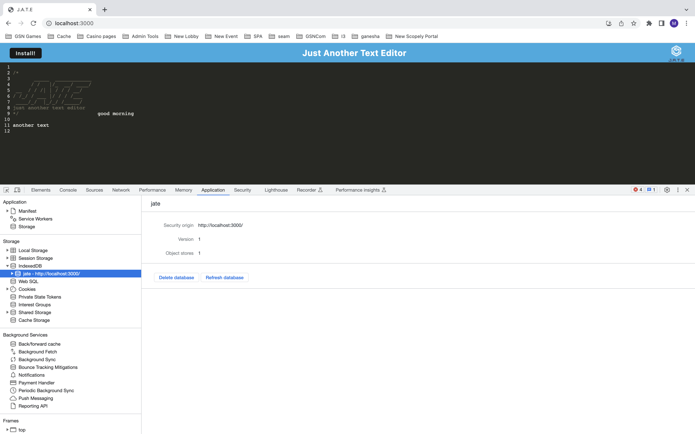
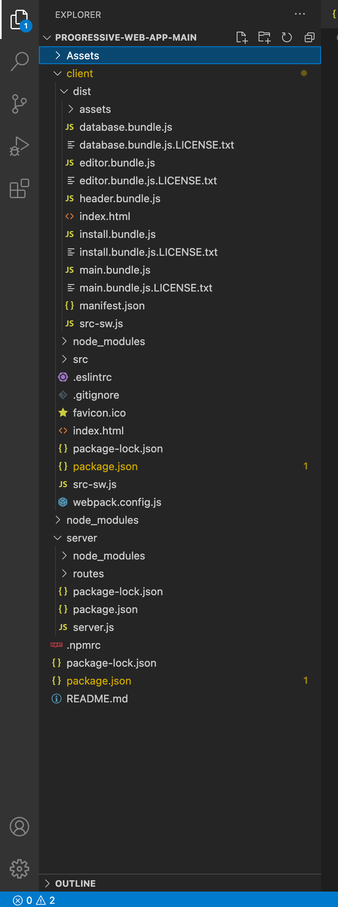
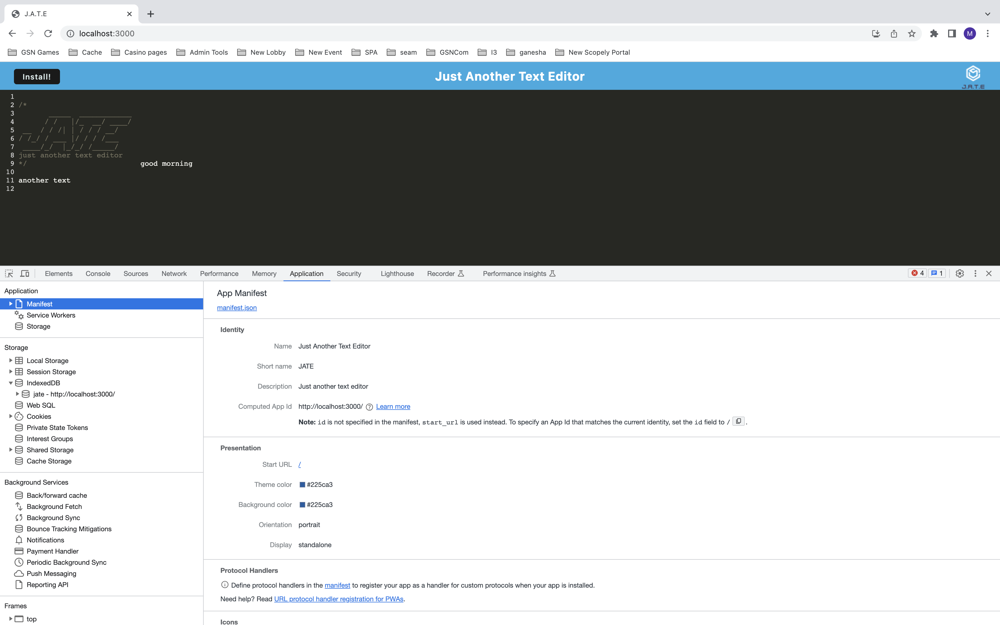

# Text Editor Progressive Web App

## Project Description

This application is a text editor that runs in the browser. The application will also function offline using data persistence techniques that serve as redundancy in case one of the options is not supported by the browser.

## Techstack

Node JS.
Express JS.
idb.
webpack.
concurrently.
css-loader.
webpack-pwa-manifest.
@babel/core.

## Screenshots

Below screenshot shows app running in local

Below screenshot shows indexed db created in browser

Below screenshot shows geberated build files

Below screenshot shows service workers in browser

## Project Installation

To install the project follow below steps.

1. Download the project or clone this repository using git clone
2. Open terminal and run the command 'npm install'
3. Open terminal and run the commands 'cd server' and 'npm install'
4. Open terminal and run the commands 'cd client' and 'npm install'
5. Open terminal and run the commands 'cd client' and 'npm run build'
5. In terminal run the command 'npm run start'

## Usage

1. Run the command 'npm run start' to run the application in terminal.
2. Open 'http://localhost:3000/'

## Testing
 No Test cases specified.

 ### Reach me here: 
 
 Have Queries? Reach me at
 Email : vijay.cheruku@live.com